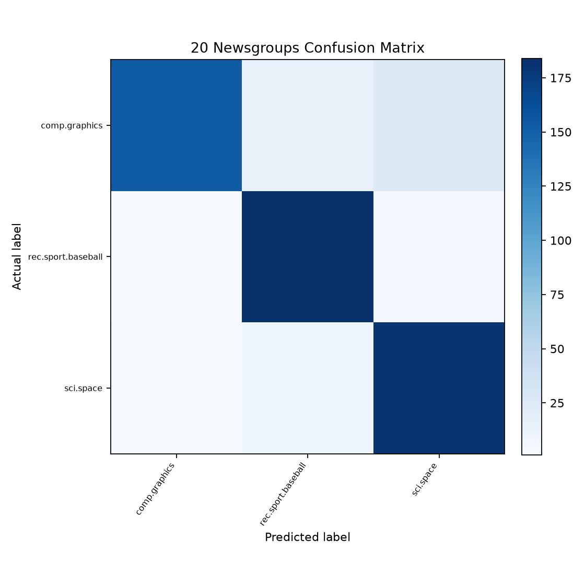

# 원하는 문서를 똑똑하게 찾아주는 검색기

20 Newsgroups의 세 주제에 deterministic structured-PII redaction과 artifact 최소화를 적용한 뒤 NumPy TF-IDF와 코사인 검색 및 선형 SVM 분류를 재현하는 privacy-conscious 프로젝트다.

## 실행 방법

Python 3.10 이상이 필요하다. 첫 build는 scikit-learn loader가 원본 데이터셋을 내려받으므로 네트워크 연결이 필요할 수 있다.

### uv 사용

```bash
uv sync --extra dev
uv run python main.py build
uv run python main.py --query "space shuttle orbit" --topk 5
uv run pytest -q
```

### venv와 pip 사용

```bash
python3 -m venv .venv
source .venv/bin/activate
python -m pip install -e '.[dev]'
python main.py build
python main.py --query "space shuttle orbit" --topk 5
python -m pytest -q
```

`build`는 `artifacts/runtime/`의 검색 인덱스와 `artifacts/reports/`의 평가 자료를 같은 경로에 덮어쓴다. 변경 전 runtime metadata는 호환 로딩하지 않으며, 검색 시 재빌드 안내 오류를 낸다.

## 데이터와 개인정보 경계

scikit-learn의 `fetch_20newsgroups(subset="all")`에서 다음 세 카테고리만 불러온다.

- `comp.graphics`
- `rec.sport.baseball`
- `sci.space`

### 왜 세 카테고리만 선택했는가

이 세 카테고리는 미션 예시와 같고 서로 구분되는 기술·스포츠·과학 주제라 다중 분류 결과를 설명하기 쉽다. 다른 카테고리가 모두 위험하다는 뜻은 아니며, 카테고리 선택 자체를 개인정보 보호 수단으로 간주하지 않는다. 세 카테고리 안의 모든 문서에도 같은 privacy pipeline을 적용한다.

### Privacy pipeline과 데이터 경계

loader는 headers, footers, quotes를 제거한 뒤 이메일, 명확한 전화번호, URL과 유효한 IPv4·IPv6를 deterministic하게 redaction한다. redaction과 영문 정규화 뒤 빈 문서만 제외한다. 사람 이름·주소 같은 자유형 엔터티를 추측하는 detector나 의심 문서 전체 삭제는 적용하지 않는다.

정제된 전체 문서는 실행 중 TF-IDF fit/transform, 분류와 검색 행렬 생성에만 사용하고 저장하지 않는다. runtime metadata, 검색 결과와 오분류 보고서에는 structured-PII sanitization을 다시 적용하고 검증한 최대 240자의 snippet만 기록한다. 공개 검색 문서 ID는 filtering 전 loader 행 번호를 유지한다.

이 설계는 “PII-free”를 보증하지 않는다. 대신 상대적으로 저위험인 세 카테고리 선택, metadata 제거, 확실한 structured identifier redaction, full-text 비저장과 bounded snippet으로 잔여 노출 범위를 줄인다.

### 실제 privacy 처리 결과

| 범위 | raw | retained | excluded | 유지율 |
|---|---:|---:|---:|---:|
| 전체 | 2,954 | 2,863 | 91 | 96.92% |
| `comp.graphics` | 973 | 953 | 20 | 97.94% |
| `rec.sport.baseball` | 994 | 956 | 38 | 96.18% |
| `sci.space` | 987 | 954 | 33 | 96.66% |

카테고리 유지율의 최대 차이는 약 1.76%p다. 현재 측정에서는 sanitization 후 빈 문서 제외 때문에 한 클래스만 크게 무너지는 현상이 없다.

| 제외 사유 | 문서 수 |
|---|---:|
| sanitization 후 빈 문서 | 91 |

| redaction 종류 | 횟수 |
|---|---:|
| email | 1,237 |
| phone | 566 |
| URL | 1 |
| IPv4 | 485 |
| IPv6 | 8 |

데이터 출처, 귀속, 라이선스 및 파생 정책은 [DATASET_LICENSE.md](DATASET_LICENSE.md)에 기록했다.

## 전처리와 TF-IDF

`EnglishPreprocessor`는 모든 문서와 검색 쿼리에 같은 순서를 적용한다.

1. 소문자로 변환한다.
2. 영문자와 공백 외 문자를 공백으로 치환한다.
3. whitespace로 분할한다.
4. 한 글자 토큰과 고정 불용어를 제거한다.

동의어 치환은 사용하지 않는다. 외부 어휘 자원에 새로운 의미 가정을 의존하게 되고, 문맥에 맞지 않는 치환이 생길 수 있으며, 직접 구현과 scikit-learn 검증의 분석 경계도 불필요하게 달라지기 때문이다.

TF-IDF는 다음 정의를 NumPy 배열과 자체 `SparseMatrix`로 계산한다.

```text
TF(t, d)       = count(t, d)
IDF(t)         = log((1 + N) / (1 + df(t))) + 1
TF-IDF(t, d)   = TF(t, d) × IDF(t)
L2 정규화       = TF-IDF(d) / ||TF-IDF(d)||₂
```

학습 문서에서만 vocabulary와 IDF를 fit하고 테스트 및 전체 검색 문서는 같은 공간으로 transform한다. scikit-learn `TfidfVectorizer`와의 최대 절대 오차 허용치는 `1e-6`이다.

## 검색과 분류

문서와 쿼리 벡터는 L2 정규화되어 있으므로 코사인 유사도는 내적과 같다. `sparse_dot`은 `np.intersect1d(..., return_indices=True)`로 공통 열의 위치를 찾고 `np.dot`으로 대응 TF-IDF 값을 계산한다. 동점은 공개 source document ID 오름차순으로 정렬한다.

분류는 `SGDClassifier(loss="hinge")`를 사용한다. 프로젝트와 테스트 코드는 SciPy를 직접 import하지 않으며, 학습과 예측 때 자체 희소 행렬의 행을 `batch_size` 이하 NumPy 밀집 배열로만 변환한다. 전체 말뭉치를 한 번에 밀집화하지 않는다.

## 재현 결과

고정 설정은 stratified 8:2 분할, `random_state=42`, 세 카테고리다. 현재 저장된 보고서는 다음 결과를 기록한다.

| 항목 | 재빌드 결과 |
|---|---:|
| 정제 후 문서 | 2,863 |
| 학습 / 테스트 문서 | 2,290 / 573 |
| vocabulary | 21,662 |
| 전체 행렬 shape | 2,863 × 21,662 |
| `nnz` | 178,950 |
| 밀도 / 희소율 | 0.288544% / 99.711456% |
| 밀집 / 자체 희소 저장 크기 | 496,146,448 / 2,158,856 bytes |
| 밀집 대비 저장 효율 | 229.8191배 |
| TF-IDF 최대 절대 오차 | 1.6653345369377348e-15 |
| Accuracy | 0.9040139616055847 |
| macro F1 | 0.9030980112997345 |
| 전체 오분류 | 55 |

기존 68-term allowlist 결과와 비교하면 retained 문서는 2,048개에서 2,863개로, vocabulary는 68개에서 21,662개로, `nnz`는 6,260에서 178,950으로 증가했다. 정확도는 약 94.15%에서 90.40%로 낮아졌지만, 주제 정답을 암시하도록 수동 선택한 68개 단어가 아니라 실제 문장 어휘를 사용하는 더 현실적인 실험이다.

`space shuttle orbit`의 Top-5도 모두 `sci.space`였다.

| 순위 | 점수 | source document ID | 카테고리 |
|---:|---:|---:|---|
| 1 | 0.340539 | 2,150 | `sci.space` |
| 2 | 0.324998 | 42 | `sci.space` |
| 3 | 0.301737 | 566 | `sci.space` |
| 4 | 0.296000 | 897 | `sci.space` |
| 5 | 0.290371 | 2,710 | `sci.space` |



정확한 원시 값과 안전 스니펫은 build가 생성한 다음 파일을 기준으로 한다.

| 파일 | 내용 |
|---|---|
| `artifacts/reports/metrics.json` | 문서·분할 수, 모델 설정, Accuracy, macro F1 |
| `artifacts/reports/tfidf_validation.json` | scikit-learn 대조 설정과 오차 |
| `artifacts/reports/matrix_stats.json` | shape, `nnz`, 밀도, 저장 byte |
| `artifacts/reports/privacy_report.json` | redaction·제외·카테고리별 유지 통계 |
| `artifacts/reports/stage_example.json` | TF → IDF → TF-IDF 중간값 |
| `artifacts/reports/search_examples.json` | 세 쿼리의 안전한 Top-5 스니펫 |
| `artifacts/reports/misclassifications.json` | 안전한 오분류 스니펫 최대 20건 |
| `artifacts/reports/confusion_matrix.png` | 세 클래스 혼동 행렬 |

## 한계

- structured identifier regex는 자유 형식의 사람 이름·주소·건강정보를 탐지하지 않는다. 이 pipeline은 PII-free 보증이 아니며, 실제 배포에는 별도의 데이터 거버넌스 검토가 필요하다.
- BoW는 어순, 부정, 관점 및 다의어를 직접 표현하지 못한다.
- 현재 검색은 모든 문서를 순회하는 정확 검색이므로 문서 수에 따라 지연 시간이 선형 증가한다.
- 카테고리 일치는 정성적 검색 예시일 뿐 사람의 relevance judgment나 mAP 평가를 대신하지 않는다.
