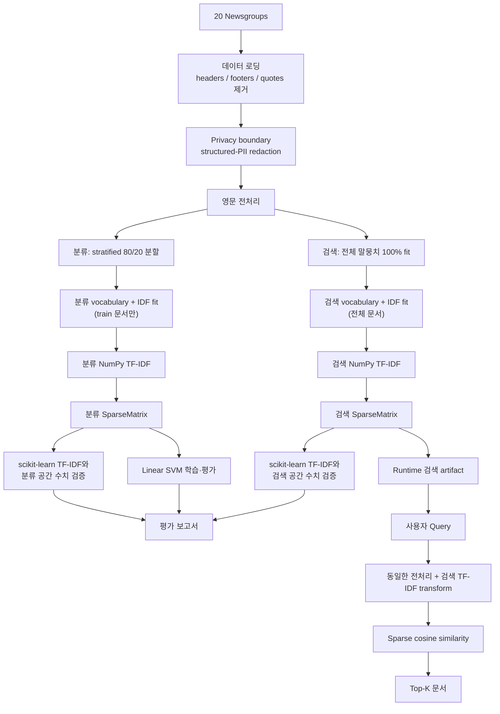

# 원하는 문서를 똑똑하게 찾아주는 검색기

## 프로젝트 소개

20 Newsgroups 문서를 대상으로 **TF-IDF 기반 문서 검색과 주제 분류를 직접 구현하고 검증하는 프로젝트**다.

scikit-learn의 완성된 TF-IDF 구현을 그대로 사용하는 대신, 텍스트를 전처리하고 vocabulary와 IDF를 학습한 뒤 NumPy 배열과 자체 희소 행렬 표현으로 TF-IDF를 계산한다. 분류와 검색은 같은 전처리를 쓰되 목적에 맞는 독립된 TF-IDF 공간을 사용하며, 직접 구현한 결과는 scikit-learn과 수치적으로 비교해 검증한다.

또한 공개 텍스트 데이터라도 불필요한 식별정보와 원문을 그대로 보관하지 않도록 structured-PII redaction과 artifact 최소화를 적용한다. 이 privacy 처리는 검색·분류 알고리즘과 분리된 데이터 경계에서 수행한다.

## 핵심 특징

- **NumPy 기반 TF-IDF 직접 구현**: vocabulary 생성, document frequency, smoothed IDF, TF-IDF weighting과 L2 정규화를 직접 계산한다.
- **자체 희소 행렬 표현**: 전체 TF-IDF 행렬을 밀집 배열로 만들지 않고 `data`, `indices`, `indptr` 기반의 희소 표현으로 저장하고 연산한다.
- **코사인 유사도 기반 문서 검색**: L2 정규화된 문서와 질의 벡터의 희소 내적으로 관련 문서를 검색한다.
- **선형 SVM 문서 분류**: 분류 전용 TF-IDF 표현을 `SGDClassifier(loss="hinge")` 기반 다중 클래스 분류에 사용한다.
- **직접 구현에 대한 수치 검증**: 동일한 vocabulary와 설정을 사용하는 scikit-learn `TfidfVectorizer`와 비교해 수치적 일치 여부를 검증한다.
- **Privacy-conscious 데이터 처리**: headers, footers, quotes를 제거하고 structured identifier를 deterministic하게 redaction하며, 전체 정제 문서는 runtime artifact에 저장하지 않는다.
- **재현 가능한 실험 파이프라인**: 고정된 데이터 분할과 random seed로 분류 지표, TF-IDF 검증값, 희소 행렬·privacy 처리 통계를 기록한다.

## 아키텍처

프로젝트는 **오프라인 build 단계**와 **온라인 검색 단계**를 분리한다.



분류 vocabulary와 IDF는 학습 문서에만 fit하고 테스트 문서를 그 공간으로 transform해 평가 단계의 data leakage를 막는다. 검색은 별도의 vocabulary와 IDF를 전체 정제 말뭉치에 fit해 100% 문서 검색 행렬을 만든다. 따라서 분류와 검색은 독립된 vocabulary/IDF 공간을 사용하며, 검색 시에는 build가 저장한 runtime artifact만 사용한다.

## 실행 방법

Python 3.10 이상이 필요하다. 첫 build는 scikit-learn loader가 원본 데이터셋을 내려받으므로 네트워크 연결이 필요할 수 있다.

### uv 사용

```bash
uv sync --extra dev
uv run python main.py build
uv run python main.py --query "space shuttle orbit" --topk 5
uv run pytest -q
```

### venv와 pip 사용

```bash
python3 -m venv .venv
source .venv/bin/activate
python -m pip install -e '.[dev]'
python main.py build
python main.py --query "space shuttle orbit" --topk 5
python -m pytest -q
```

`build`는 `artifacts/runtime/`의 검색 인덱스와 `artifacts/reports/`의 평가 자료를 같은 경로에 덮어쓴다. 변경 전 runtime metadata는 호환 로딩하지 않으며, 검색 시 재빌드 안내 오류를 낸다.

## 데이터와 개인정보 경계

scikit-learn의 `fetch_20newsgroups(subset="all")`에서 제공하는 고정된 20개 카테고리 전체를 사용한다. 카테고리 제한을 개인정보 보호 수단으로 쓰지 않으며, 모든 카테고리에 같은 privacy pipeline을 적용한다.

- `alt.atheism`, `comp.graphics`, `comp.os.ms-windows.misc`, `comp.sys.ibm.pc.hardware`, `comp.sys.mac.hardware`, `comp.windows.x`
- `misc.forsale`, `rec.autos`, `rec.motorcycles`, `rec.sport.baseball`, `rec.sport.hockey`
- `sci.crypt`, `sci.electronics`, `sci.med`, `sci.space`, `soc.religion.christian`
- `talk.politics.guns`, `talk.politics.mideast`, `talk.politics.misc`, `talk.religion.misc`

`sci.med`도 이 계약에 포함된다. 현재 structured redaction은 이메일·전화번호·URL·IP 같은 형식화된 식별자만 대상으로 하므로, 자유 형식의 건강 정보는 제거하지 않는다.

### Privacy pipeline과 데이터 경계

loader는 headers, footers, quotes를 제거한 뒤 이메일, 명확한 전화번호, URL과 유효한 IPv4·IPv6를 deterministic하게 redaction한다. redaction과 영문 정규화 뒤 빈 문서만 제외한다. structured identifier만 제거하므로 PII-free를 보증하지 않으며, 특히 자유 형식의 건강 정보는 잔존할 수 있다.

정제된 전체 문서는 실행 중 TF-IDF fit/transform, 분류와 검색 행렬 생성에만 사용하고 저장하지 않는다. runtime metadata, 검색 결과와 오분류 보고서에는 structured-PII sanitization을 다시 적용하고 검증한 최대 240자의 snippet만 기록한다. 공개 검색 문서 ID는 filtering 전 loader 행 번호를 유지한다.

| 처리 | 근거 |
|---|---|
| headers, footers, quotes 제거 | 불필요한 metadata 노출과 metadata 과적합을 줄여 더 현실적인 분류 평가를 한다. ([scikit-learn 권장](https://scikit-learn.org/stable/datasets/real_world.html)) |
| 이메일·전화번호·URL·유효한 IP redaction | 직접 식별·연락에 쓰일 수 있는 structured identifier를 재현 가능한 규칙으로 제거한다. |
| 자유형 엔터티 미탐지 | 검증되지 않은 추측성 이름 규칙은 오탐과 어휘 왜곡을 낳을 수 있어 적용하지 않는다. |
| full text 비저장, 최대 240자 snippet | 원문 재배포와 불필요한 노출을 줄이면서 검색 결과를 확인할 수 있게 한다. |
| 빈 문서만 제외 | 주관적 문서 제거 대신 제외 수와 카테고리별 유지율을 build마다 기록한다. |

### 실제 privacy 처리 결과

| 범위 | raw | retained | excluded | 유지율 |
|---|---:|---:|---:|---:|
| 전체 | 18,846 | 18,309 | 537 | 97.15% |
| `sci.med` | 990 | 960 | 30 | 96.97% |

카테고리별 raw·retained·excluded 수는 `privacy_report.json`의 20개 항목에 기록한다. 이 수치는 structured redaction의 결과이지, 자유 형식 개인정보가 없다는 보장은 아니다.

| 제외 사유 | 문서 수 |
|---|---:|
| sanitization 후 빈 문서 | 537 |

| redaction 종류 | 횟수 |
|---|---:|
| email | 6,405 |
| phone | 2,157 |
| URL | 2 |
| IPv4 | 759 |
| IPv6 | 253 |

데이터 출처, 귀속, 라이선스 및 파생 정책은 [DATASET_LICENSE.md](DATASET_LICENSE.md)에 기록했다.

## 전처리와 TF-IDF

`EnglishPreprocessor`는 모든 문서와 검색 쿼리에 같은 순서를 적용한다.

1. 소문자로 변환한다.
2. 영문자와 공백 외 문자를 공백으로 치환한다.
3. whitespace로 분할한다.
4. 한 글자 토큰과 고정 불용어를 제거한다.

동의어 치환은 사용하지 않는다. 외부 어휘 자원에 새로운 의미 가정을 의존하게 되고, 문맥에 맞지 않는 치환이 생길 수 있으며, 직접 구현과 scikit-learn 검증의 분석 경계도 불필요하게 달라지기 때문이다.

불용어 적용·미적용의 이전 수치 비교는 세 카테고리 범위에서만 수행된 기록이므로 현재 20-category 결과로 일반화하지 않는다. 전체 카테고리 loader를 쓰는 방법과 현재 Python 검색 루프의 계산 한계는 [stop-word ablation](docs/stop-word-ablation.md)에 기록했다.

TF-IDF는 다음 정의를 NumPy 배열과 자체 `SparseMatrix`로 계산한다.

```text
TF(t, d)       = count(t, d)
IDF(t)         = log((1 + N) / (1 + df(t))) + 1
TF-IDF(t, d)   = TF(t, d) × IDF(t)
L2 정규화       = TF-IDF(d) / ||TF-IDF(d)||₂
```

분류는 학습 문서에서만 vocabulary와 IDF를 fit하고 테스트 문서를 그 공간으로 transform한다. 검색은 전체 정제 말뭉치에서 별도의 vocabulary와 IDF를 fit한다. 두 공간은 각각 scikit-learn `TfidfVectorizer`와 비교하며 최대 절대 오차 허용치는 `1e-6`이다. 검증 시 직접 구현의 raw-count TF, smoothed IDF, L2 정규화와 맞추기 위해 다음 설정을 고정한다.

```text
smooth_idf=True
sublinear_tf=False
norm="l2"
use_idf=True
dtype=float64
```

## 검색과 분류

문서와 쿼리 벡터는 L2 정규화되어 있으므로 코사인 유사도는 내적과 같다. `sparse_dot`은 `np.intersect1d(..., return_indices=True)`로 공통 열의 위치를 찾고 `np.dot`으로 대응 TF-IDF 값을 계산한다. 동점은 공개 source document ID 오름차순으로 정렬한다.

분류는 `SGDClassifier(loss="hinge")`를 사용한다. 프로젝트와 테스트 코드는 SciPy를 직접 import하지 않으며, 학습과 예측 때 자체 희소 행렬의 행을 `batch_size` 이하 NumPy 밀집 배열로만 변환한다. 전체 말뭉치를 한 번에 밀집화하지 않는다.

## 재현 결과

고정 설정은 20개 카테고리 전체의 stratified 8:2 분할과 `random_state=42`다. 현재 저장된 보고서는 다음 결과를 기록한다.

| 항목 | 재빌드 결과 |
|---|---:|
| 정제 후 문서 | 18,309 |
| 학습 / 테스트 문서 | 14,647 / 3,662 |
| 분류 vocabulary | 78,613 |
| 검색 vocabulary | 91,538 |
| 검색 전체 행렬 shape | 18,309 × 91,538 |
| `nnz` | 1,230,094 |
| 밀도 / 희소율 | 0.073395977% / 99.926604023% |
| 밀집 / 자체 희소 저장 크기 | 13,407,753,936 / 14,834,368 bytes |
| 밀집 대비 저장 효율 | 903.8304790605167배 |
| 분류 TF-IDF 최대 절대 오차 | 5.440092820663267e-15 |
| 검색 TF-IDF 최대 절대 오차 | 9.2148511043888e-15 |
| Accuracy | 0.7670671764063354 |
| macro F1 | 0.7543850883245388 |
| 전체 오분류 | 853 |

`space shuttle orbit`의 Top-5도 모두 `sci.space`였다.

| 순위 | 점수 | source document ID | 카테고리 |
|---:|---:|---:|---|
| 1 | 0.413791 | 4,672 | `sci.space` |
| 2 | 0.384463 | 4,389 | `sci.space` |
| 3 | 0.373090 | 5,788 | `sci.space` |
| 4 | 0.368089 | 12,888 | `sci.space` |
| 5 | 0.364911 | 10,571 | `sci.space` |


혼동 행렬은 20 × 20이며, 행과 열은 위의 고정된 20개 카테고리 순서를 사용한다.

정확한 원시 값과 안전 스니펫은 build가 생성한 다음 파일을 기준으로 한다.

| 파일 | 내용 |
|---|---|
| `artifacts/reports/metrics.json` | 문서·분할 수, 모델 설정, Accuracy, macro F1 |
| `artifacts/reports/tfidf_validation.json` | scikit-learn 대조 설정과 오차 |
| `artifacts/reports/matrix_stats.json` | shape, `nnz`, 밀도, 저장 byte |
| `artifacts/reports/privacy_report.json` | redaction·제외·카테고리별 유지 통계 |
| `artifacts/reports/stage_example.json` | TF → IDF → TF-IDF 중간값 |
| `artifacts/reports/search_examples.json` | 세 쿼리의 안전한 Top-5 스니펫 |
| `artifacts/reports/misclassifications.json` | 안전한 오분류 스니펫 최대 20건 |
| `artifacts/reports/confusion_matrix.png` | 20 × 20 혼동 행렬 |

## 한계와 개선 방향

`misclassifications.json`에는 현재 build의 안전한 스니펫을 최대 20건 저장한다. 예를 들어 `alt.atheism → rec.autos`, `sci.med → rec.sport.baseball`, `comp.os.ms-windows.misc → comp.graphics`처럼 짧거나 주제 단서가 약한 문서와 인접 주제의 혼동이 보인다. 스니펫은 최대 240자로 원문의 전체 문맥을 보존하지 않는다.

### 개선 방향

- 단어 bi-gram을 추가해 함께 나타날 때 의미가 달라지는 표현을 보존한다.
- 매우 짧거나 어휘가 없는 문서는 낮은 신뢰도로 표시해 재검토 대상으로 분리한다.
- 다음 학습 단계에서는 문맥을 표현하는 임베딩 기반 모델과 원문 단위 라벨 점검을 비교해 BoW 기준선의 한계를 정량적으로 확인한다.

- structured identifier regex는 자유 형식의 사람 이름·주소·건강정보를 탐지하지 않는다. 이 pipeline은 PII-free 보증이 아니며, 실제 배포에는 별도의 데이터 거버넌스 검토가 필요하다.
- BoW는 어순, 부정, 관점 및 다의어를 직접 표현하지 못한다.
- 현재 검색은 모든 문서를 순회하는 정확 검색이므로 문서 수에 따라 지연 시간이 선형 증가한다.
- 카테고리 일치는 정성적 검색 예시일 뿐 사람의 relevance judgment나 mAP 평가를 대신하지 않는다.
